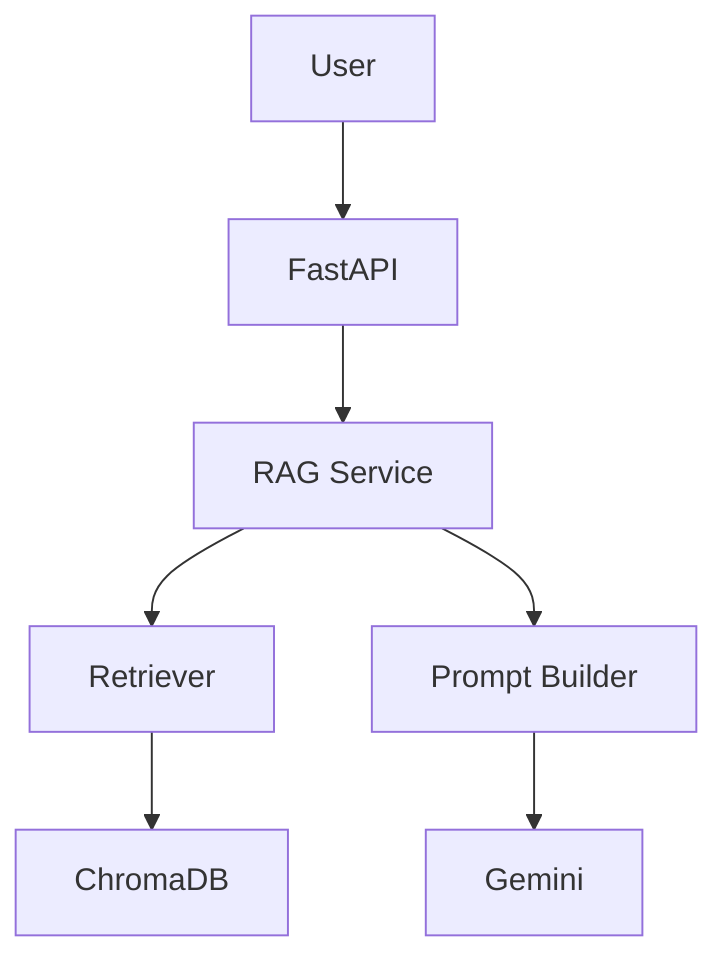
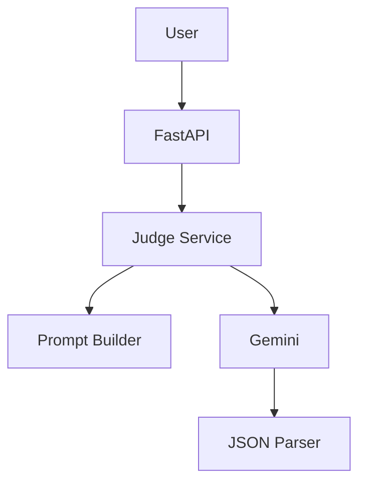

# GenAI Engineering Take-Home Assignment

A production-oriented implementation of a Retrieval-Augmented Generation (RAG) system and an LLM-as-a-Judge evaluation service built using **FastAPI**, **Google Gemini**, and **ChromaDB**.

---

# Project Overview

This repository contains solutions for two independent engineering problems:

- **Problem 1:** Retrieval-Augmented Generation (RAG) Question Answering API
- **Problem 2:** LLM-as-a-Judge Evaluation API

Both solutions follow modern software engineering principles including:

- Clean Architecture
- SOLID Principles
- Dependency Injection
- Configuration-driven design
- Structured logging
- Unit testing
- FastAPI
- Production-quality error handling

---

## Key Highlights

- Production-oriented Clean Architecture
- SOLID design principles
- Dependency Injection
- Persistent ChromaDB vector store
- Gemini-powered RAG and LLM Judge
- Schema-constrained JSON generation
- Comprehensive unit test coverage
- Structured logging and exception handling

---

# Repository Structure

```text
genai-engineering-assignment/

├── problem1_rag/
│   ├── api/
│   ├── core/
│   ├── models/
│   ├── prompts/
│   ├── services/
│   ├── tests/
│   └── main.py
│
├── problem2_llm_judge/
│   ├── api/
│   ├── core/
│   ├── models/
│   ├── prompts/
│   ├── services/
│   ├── tests/
│   └── main.py
│
├── docs/
├── submission/
├── requirements.txt
└── README.md
```

---

# Problem 1 – Retrieval-Augmented Generation

## Features

- FastAPI REST API
- ChromaDB persistent vector database
- RecursiveCharacterTextSplitter
- sentence-transformers/all-MiniLM-L6-v2 embeddings
- Gemini 3.1 Flash Lite
- Prompt Builder
- Retrieval pipeline
- CLI ingestion pipeline
- Health endpoint
- Question Answering endpoint
- Unit tests

---

## Architecture



---

# Problem 2 – LLM Judge

## Features

- FastAPI API
- Gemini structured JSON output
- Prompt Builder
- JSON parser
- Retry mechanism
- Dependency Injection
- Structured logging
- Exception handling
- Unit tests

---

## Architecture



---

# Technology Stack

- Python 3.11
- FastAPI
- Google Gemini API
- ChromaDB
- Sentence Transformers
- Pydantic
- Pytest

---

# Installation

```bash
git clone <repository-url>

cd genai-engineering-assignment

pip install -r requirements.txt
```

---

# Environment Variables

Create a `.env` file:

```env
GEMINI_API_KEY=YOUR_API_KEY
GEMINI_MODEL=gemini-3.1-flash-lite
```

---

# Running Problem 1

### Ingest Documents

```bash
python -m problem1_rag.ingest
```

### Start API

```bash
uvicorn problem1_rag.main:app --reload
```

---

# Running Problem 2

```bash
uvicorn problem2_llm_judge.main:app --reload
```

---

# API Endpoints

## Problem 1

| Method | Endpoint | Description |
|--------|----------|-------------|
| GET | `/health` | Health check |
| POST | `/ask` | Ask questions using RAG |

---

## Problem 2

| Method | Endpoint | Description |
|--------|----------|-------------|
| GET | `/health` | Health check |
| POST | `/judge` | Evaluate LLM responses |

---

# Running Tests

Problem 1

```bash
pytest problem1_rag/tests -v
```

Problem 2

```bash
pytest problem2_llm_judge/tests -v
```

Run all tests

```bash
pytest -v
```

---

# Design Decisions

## Problem 1

- ChromaDB selected for persistent vector storage
- RecursiveCharacterTextSplitter for semantic chunking
- Sentence Transformers for lightweight embeddings
- CLI ingestion separates indexing from serving
- Dependency Injection for loose coupling

## Problem 2

- Gemini structured JSON generation using response schemas
- Robust JSON parsing and validation with Pydantic
- Retry mechanism for transient LLM failures
- Custom exception hierarchy
- Dependency Injection for service management

---

# Future Improvements

- Streaming responses
- Authentication
- Batch evaluation
- Metrics dashboard
- Docker deployment
- CI/CD pipeline
