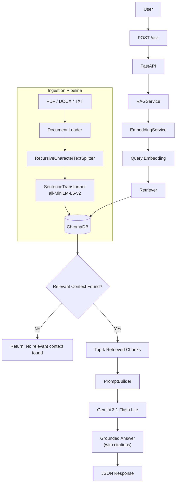
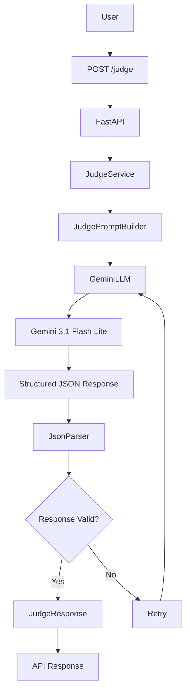
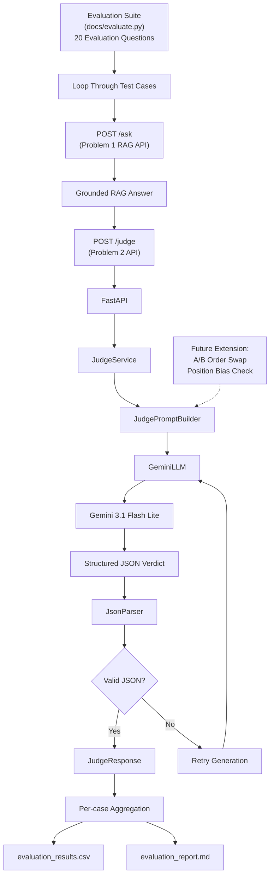

# GenAI Engineering Assignment

> A production-oriented implementation of a **Retrieval-Augmented Generation (RAG)** system and an **LLM-as-a-Judge** evaluation service built using **FastAPI**, **ChromaDB**, **Sentence Transformers**, and **Google Gemini**.

---

# Project Overview

This repository contains solutions for two independent engineering tasks:

- **Problem 1:** Retrieval-Augmented Generation (RAG) Question Answering API
- **Problem 2:** LLM-as-a-Judge Evaluation API

Both services are implemented using **Clean Architecture**, **Dependency Injection**, and **SOLID principles** to ensure modularity, maintainability, and testability.

---

# Features

## Problem 1 – Retrieval-Augmented Generation

- FastAPI REST API
- Persistent ChromaDB vector database
- RecursiveCharacterTextSplitter
- SentenceTransformer embeddings (`all-MiniLM-L6-v2`)
- Google Gemini 3.1 Flash Lite
- CLI document ingestion pipeline
- Grounded answers with source citations
- Health endpoint
- Unit tested

---

## Problem 2 – LLM-as-a-Judge

- FastAPI REST API
- Reference-free pointwise evaluation
- Structured JSON output
- Prompt Builder
- JSON parsing & validation
- Retry mechanism for malformed JSON
- Structured logging
- Unit tested

---

# Repository Structure

```text
genai-engineering-assignment/
│
├── problem1_rag/
│   ├── app/
│   ├── tests/
│   ├── data/
│   ├── ingest.py
│   └── main.py
│
├── problem2_llm_judge/
│   ├── app/
│   ├── tests/
│   └── main.py
│
├── docs/
│   ├── evaluate.py
│   ├── evaluation_results.csv
│   └── evaluation_report.md
│
├── requirements.txt
├── README.md
└── LICENSE
```

---

# Technology Stack

| Category | Technology |
|-----------|------------|
| Language | Python 3.11 |
| Framework | FastAPI |
| Vector Database | ChromaDB |
| Embedding Model | sentence-transformers/all-MiniLM-L6-v2 |
| LLM | Gemini 3.1 Flash Lite |
| Chunking | RecursiveCharacterTextSplitter |
| Validation | Pydantic |
| Testing | Pytest |

---

# Problem 1 RAG Architecture


---

# Problem 2 Architecture


---

# Evaluation Pipeline For LLM Judge and RAG System



---

# Installation

```bash
git clone https://github.com/jayant-abhinav/genai-engineering-assignment.git

cd genai-engineering-assignment

pip install -r requirements.txt
```

---

# Environment Variables

Create a `.env` file in the project root.

```env
GEMINI_API_KEY=YOUR_API_KEY
GEMINI_MODEL=gemini-3.1-flash-lite
```

---

# Running Problem 1

## Ingest Documents

```bash
python -m problem1_rag.ingest \
    --input-dir problem1_rag/data/evaluation_docs \
    --reset-db
```

Default configuration

- Chunk Size: **500**
- Chunk Overlap: **50**

---

## Start API

```bash
uvicorn problem1_rag.main:app --reload
```

Swagger UI

```
http://127.0.0.1:8000/docs
```

---

# Running Problem 2

```bash
uvicorn problem2_llm_judge.main:app --reload --port 8001
```

Swagger UI

```
http://127.0.0.1:8001/docs
```

---

# Running the Evaluation Pipeline

Start both services.

Terminal 1

```bash
uvicorn problem1_rag.main:app --port 8000
```

Terminal 2

```bash
uvicorn problem2_llm_judge.main:app --port 8001
```

Run the evaluation script.

```bash
python docs/evaluate.py
```

Generated outputs

```
docs/evaluation_results.csv
docs/evaluation_report.md
```

---

# API Endpoints

## Problem 1

| Method | Endpoint | Description |
|----------|----------|-------------|
| GET | `/health` | Health check |
| POST | `/ask` | Ask a question using the RAG system |

---

## Problem 2

| Method | Endpoint | Description |
|----------|----------|-------------|
| GET | `/health` | Health check |
| POST | `/judge` | Evaluate a generated answer |

---

# Evaluation Summary

| Metric | Value |
|---------|------:|
| Knowledge Base Documents | 8 |
| Vector Count | 71 |
| Average Overall Judge Score | 9.47 / 10 |
| Average End-to-End Latency | 1072 ms |

---

# Design Decisions

## Problem 1

- ChromaDB selected for persistent vector storage.
- RecursiveCharacterTextSplitter used for semantic chunking.
- SentenceTransformer (`all-MiniLM-L6-v2`) chosen for lightweight and efficient embeddings.
- CLI ingestion separates indexing from serving.
- Dependency Injection improves modularity and testability.

## Problem 2

- Reference-free pointwise evaluation.
- Structured JSON generation using Gemini.
- Robust JSON parsing with retry support.
- Independent JudgeService for modular evaluation.
- Separate FastAPI application for evaluation.

---

# Running Tests

Problem 1

```bash
pytest problem1_rag/tests -v
```

Problem 2

```bash
pytest problem2_llm_judge/tests -v
```

Run all tests

```bash
pytest -v
```

---

# Future Improvements

- Docker support
- CI/CD pipeline
- Authentication
- Streaming responses
- Pairwise A/B evaluation
- Position-bias analysis
- Human agreement benchmarking
- Metrics dashboard
